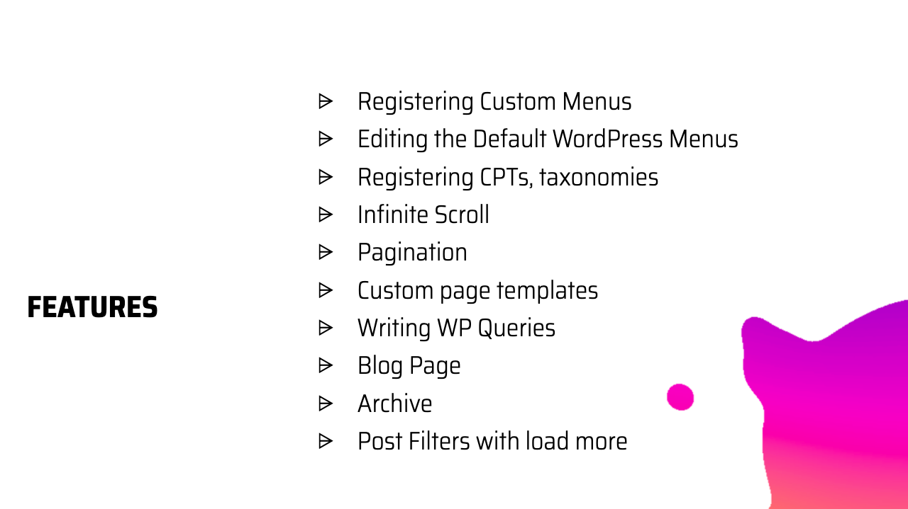
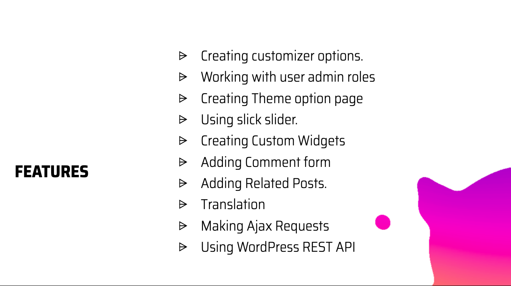
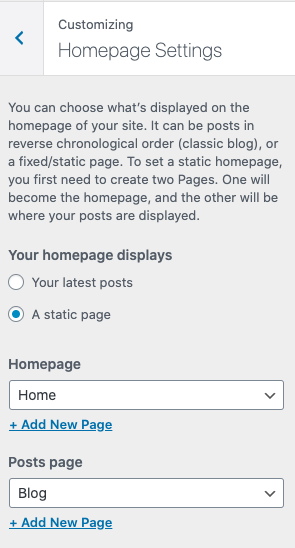

# [WordPress Theme]🎨


* A WordPress theme Project for Advanced WordPress Theme Development Course.


## [Tutorial Course](https://codeytek.com/course/advanced-wordpress-theme-development-course/)
## Also See - [Advanced WordPress Plugin Development](https://github.com/TimelyResponse/PHP-wordpress-theme)

## Features:

- 

- 

- Custom front page.
- Custom Blog page with posts displayed in grid format using bootstrap.
- Block Style Variations
- Custom Gutenberg Blocks
- InnerBlocks

## Maintainer

| Name                                                   | Github Username |
|--------------------------------------------------------|-----------------|
| [Imran Sayed](mailto:codeytek.academy@gmail.com)       |  @imranhsayed   |

## Usage

1. Clone the WordPress theme [aquila](https://github.com/TimelyResponse/PHP-wordpress-theme) in your WordPress
themes directory and activate it.

## Dashboard Setup.

1. Create pages called 'Home' and 'Blog' and set them from Appearance > Customizer > Homepage Settings like so:

- 

## Development ( To be added )

**Install**

Clone the repo and run

```bash
cd aquila/assets
npm install
```

**During development**

```bash
npm run dev
```

Run precommit from assets directory before pushing the code for development/contribution.

```
cd assets && npm run precommit
```

**Production**

```bash
npm run prod
```

**Linting & Formatting**

The following command will fix most errors and show and remaining ones which cannot be fixed automatically.

```bash
npm run lint:fix
```

We follow the stylelint configuration used in WordPress Gutenberg, run the following command to lint and fix styles.

```bash
npm run stylelint:fix
```

Format code with prettier ( TO BE ADDED )

```bash
npm run format-js
```

Directory Structure

```php
.
├── README.md
├── assets
│   ├── main.js
│   └── src
│       └── library
│           ├── css
│           │   ├── bootstrap-grid.min.css
│           │   └── bootstrap.min.css
│           └── js
│               └── bootstrap.min.js
├── demo
│   ├── banner.png
│   ├── blog-page.png
│   ├── features-one.png
│   ├── features-two.png
│   └── home-page-customizer-setup.png
├── footer.php
├── front-page.php ( Home Page )
├── functions.php
├── header.php
├── inc
│   ├── classes
│   │   ├── class-aquila-theme.php
│   │   ├── class-assets.php
│   │   ├── class-menus.php
│   │   └── class-meta-boxes.php
│   ├── helpers
│   │   ├── autoloader.php
│   │   └── template-tags.php
│   └── traits
│       └── trait-singleton.php
├── index.php ( Blog page )
├── page.php  ( Single Page )
├── screenshot.png
├── single.php ( Single Post Page )
├── style.css
└── template-parts
    ├── components
    │   └── blog
    │       ├── entry-content.php
    │       ├── entry-footer.php
    │       ├── entry-header.php
    │       └── entry-meta.php
    ├── content-none.php
    ├── content.php
    └── header
        └── nav.php
```

### Fixing Errors

1. Error: Node Sass does not yet support your current environment
Solution : 
```shell
cd assets
npm rebuild node-sass
```
